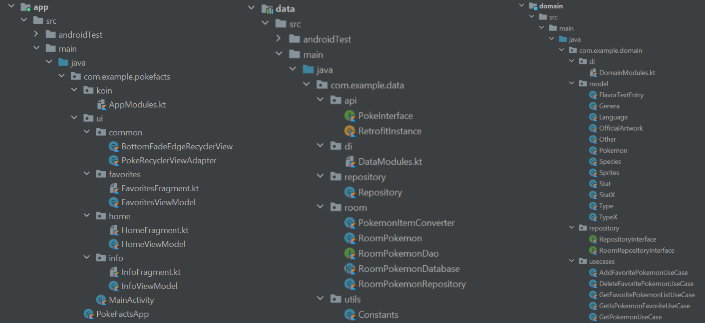

# PokéFacts 

PokéFacts is an open-source Pokémon Database app for Android based on PokéAPI and powered by Kotlin.
The app allows users to view Pokémons, search them and add them to their favorites list.

## Architecture

* This app follows Clean Architecture Principles paired with MVVM architecture.
* The project is divided into three modules *app*, *data* and *domain*.
* The *app* module contains all the mobile-app specific code including views, viewmodels, activities and adapters. 
* The *data* module contains all the code that handles data. This includes handling the Retrofit calls and reading/writing to RoomDB.
* The *domain* module contains the basic blueprint and business logic of the application. It is a Java/Kotlin Library with no Android-specific code and holds the Model(Data Classes), Interfaces and Use Cases.  
* Read more about Clean Architecture at https://blog.cleancoder.com/uncle-bob/2012/08/13/the-clean-architecture.html

  

## API Used

* PokéAPI is used for retreiving Pokémon information. 
* The *pokemon* endpoint is used for retreiving details of a single Pokémon.
* The *limit* endpoint is used for getting a list of all Pokémon names (to support search functionality).
* Read more about PokéAPI at https://pokeapi.co/

## Libraries Used

* **Retrofit** - Used to handle API calls to PokéAPI. 
* **Koin** - Used for Dependancy Injection.
* **Room** - Used to store favorite Pokémons in a Room Database for offline viewing.
* **Facebook Shimmer** - Used for loading animations throughout the app.
* **Android Palette** - Used to create a Color Palette based on the Pokémon's color for Pokémon based theming.
* **Glide** - Used to load Pokémon images into ImageViews and handle image-caching.

## Screens

### **Home Fragment**
* It shows all the Pokémons in a paginated manner.
* Pokémons are loaded in batches of 20 when the user reaches the end of the list.
* Shimmer animation is displayed when Pokémons are being loaded.
* It allows the user to view Pokémons of all types or alternatively filter them based on the Pokémon's type.
* During type-filtering of Pokémons, a combination of upto 2 types is supported.

  
  
  
  

### **Info Fragment**
* It shows the details of the selected Pokémon inlcuding it's description, basic information and stats.
* The background color of this fragment is adaptable based on the color of the selected Pokémon.

  
  
  
  
  
  
  
  

### **Search Fragment**
* It allows the user to search through all the Pokémons to find a particular Pokémon using it's name.
* The user can add the searched Pokémons to their favorites list as the favorite button is avilable on each card.

  
  
  
  

### **Favorites Fragement**
* It shows all the Pokémons that the user has added to their favorites list in the past.
* Favorite Pokémons are saved in a Room Database and can even be viewed even without an internet connection.
* A Pokémon can be added to the user's Favorites Pokémons by clicking the Add to Favorite button on a Pokémon's card on the Home Fragment, Search Fragment and the Info Fragment.
* A Pokémon can be removed from the user's Favorites Pokémons by unchecking the Add to Favorite button on a Pokémon's card on the Home Fragment, Search Fragment, Info Fragment and even the Favorite Fragment itself.

  
  
  
  

